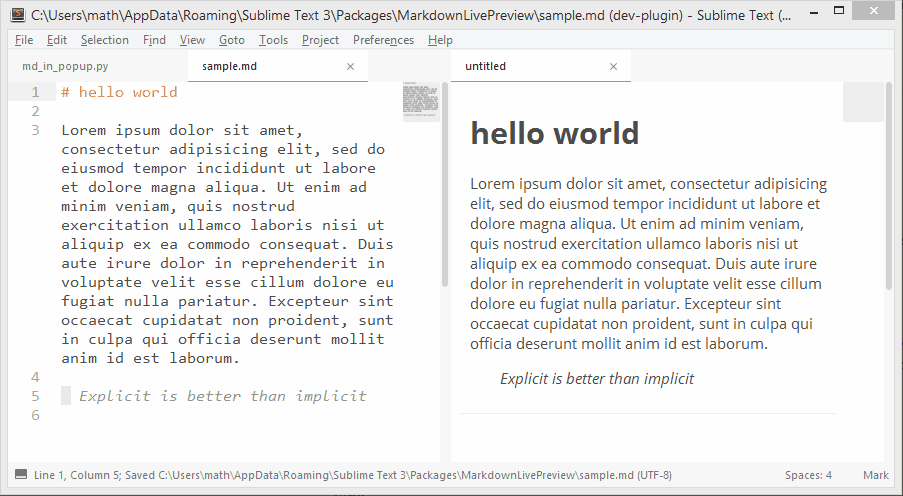

# MarkdownLivePreview 

This is a sublime text **3** plugin that allows you to preview your markdown instantly *in* it!

### Dependencies

**None**! There is no dependency! It uses [markdown2](https://github.com/trentm/python-markdown2) but it's a one file plugin, so it's included in the package.

## Installation

Although MarkdownLivePreview is not available on the default channel of [PackageControl](http://packagecontrol.io), you can still use it to download this little package.

1. Open the command palette (`ctrl+shift+p`)
2. Search for: `Package Control: Add Repository`
3. Enter in the input at the bottom of ST the path to this repo: <https://github.com/math2001/MarkdownLivePreview> (tip: just drag the link in)
4. Hit <kbd>enter</kbd>

What this does is simply adding this repo to the list of packages you get when you install a package using PC.

So, as you probably understood, now you just need to install MarkdownLivePreview as if it was available on the default channel:

1. Open the command palette (`ctrl+shift+p`)
2. Search for: `Package Control: Install Package`
3. Search for: `MarkdownLivePreview`
4. hit <kbd>enter</kbd>

Done!

### Usage

Sometimes, you just want to open a markdown file to edit it quickly, you don't care about the preview, and even worse, **you don't want it**. So, if you want to have the preview, press `alt+m`, edit your file, and you'll get a nice preview.

### In dev

This plugin is not finished, there's still some things to fix (custom css, focus, etc). So, don't run away if you have any trouble, just submit an issue [here](http://github.com/math2001/MarkdownLivePreview/issues).

### Demo

### Custom css

It is possible to set your own css. But, be carefull, you have to respect [those rules](http://www.sublimetext.com/docs/3/minihtml.html#css). Just go to `Preferences -> Package Settings -> MarkdownLivePreview`. It will open a css file, here: `$packages/User/MarkdownLivePreview.css`. Just save it and it will automatically use it instead of the default one.

### How to open the [README](http://github.com/math2001/MarkdownLivePreview/README.md)

Some of the package add a command in the menus, others in the command palette, or other nowhere. None of those options are really good, especially the last one on ST3 because the packages are compressed. But, fortunately, there is plugin that exists and **will solve this problem** for us (and he has a really cute name, don't you think?): [ReadmePlease](https://packagecontrol.io/packages/ReadmePlease).
