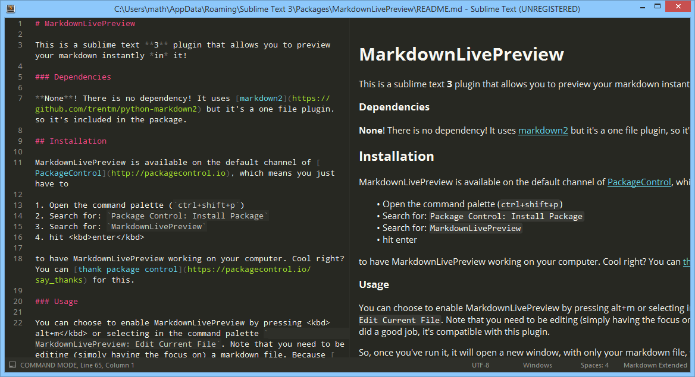

```python
import this

if you.are('new'):
    print('Welcome!')
    if you.are('brand new'):
        print("You'll see, python's just awesome")
else:
    print('Hello!')
```



<ol>
    <li>test</li>
</ol>